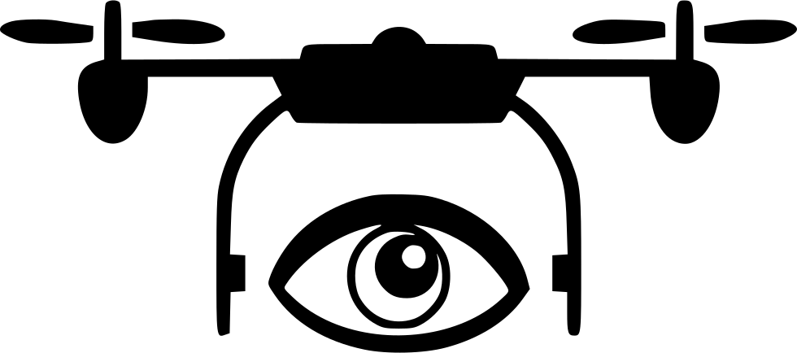

#  AerialVLN: Vision-and-language Navigation for UAVs

[Code](https://github.com/AirVLN/AirVLN) | [Paper](https://arxiv.org/abs/2308.06735) | [Data](https://github.com/AirVLN/AirVLN)

**Official implementation of the ICCV 2023 paper:**
[AerialVLN: Vision-and-language Navigation for UAVs](https://arxiv.org/abs/2308.06735)

Shubo LIU*, Hongsheng ZHANG*, Yuankai QI, Peng WANG, Yanning ZHANG, Qi WU


Instruction: Take off, fly through the tower of cable bridge and down to the end of the road. Turn left, fly over the five-floor building with a yellow shop sign and down to the intersection on the left. Head to the park and turn right, fly along the edge of the park. March forward, at the intersection turn right, and finally land in front of the building with a red billboard on its rooftop.


## Abstract

Recently emerged Vision-and-Language Navigation (VLN) tasks have drawn significant attention in both computer vision and natural language processing communities. Existing VLN tasks are built for agents that navigate on the ground, either indoors or outdoors. However, many tasks require intelligent agents to carry out in the sky, such as UAV-based goods delivery, traffic/security patrol, and scenery tour, to name a few. Navigating in the sky is more complicated than on the ground because agents need to consider the flying height and more complex spatial relationship reasoning. To fill this gap and facilitate research in this field, we propose a new task named AerialVLN, which is UAV-based and towards outdoor environments. We develop a 3D simulator rendered by near-realistic pictures of 25 city-level scenarios. Our simulator supports continuous navigation, environment extension and configuration. We also proposed an extended baseline model based on the widely-used cross-modal-alignment (CMA) navigation methods. We find that there is still a significant gap between the baseline model and human performance, which suggests AerialVLN is a new challenging task.

[Code](https://github.com/AirVLN/AirVLN) | [Paper](https://arxiv.org/abs/2308.06735) | [Data](https://github.com/AirVLN/AirVLN)


## Updates

2023/08/30🔥: We release the AerialVLN dataset, code and simulators.

2023/07/14: AerialVLN is accpeted by ICCV2023! 🎉


## TODOs
- [x] AerialVLN Dataset

- [x] AerialVLN Code

- [x] AerialVLN Simulators

- [ ] AerialVLN Challenge


## Installation

Pleae follow the following steps to install the simulator.

[Download](https://github.com/AirVLN/AirVLN/scripts/download_simulator.sh) and extract AerialVLN simulator:
```bash
bash scripts/download_simulator.sh
```

[Download](https://github.com/AirVLN/AirVLN/scripts/download_dataset_aerialvln.sh) and extract AerialVLN dataset:
```bash
bash scripts/download_dataset_aerialvln.sh
# if you want to use aerialvln-s dataset, run: bash download_dataset_aerialvln-s.sh instead
```

[Download](https://github.com/AirVLN/AirVLN) AerialVLN code and install environment:

```bash
conda create -n AerialVLN python=3.8
conda activate AerialVLN
pip install -r requirements.txt
```

Finally, your project dir should be like this:

- Project dir
    - [AirVLN](https://github.com/AirVLN/AirVLN)
    - DATA
        - data
            - aerialvln
    - ENVs
      - env_1
      - env_2
      - ...


## Running

Please see the examples in `scripts`


## Question?
Feel free to contact [Shubo LIU](mailto:shubo.liu@mail.nwpu.edu.cn) or [Hongsheng ZHANG](mailto:hongsheng.zhang@mail.nwpu.edu.cn).


## Citing
If you use AerialVLN in your research, please cite the following paper:

```
@inproceedings{liu_2023_AerialVLN,
  title={AerialVLN: Vision-and-language Navigation for UAVs},
  author={Shubo Liu and Hongsheng Zhang and Yuankai Qi and Peng Wang and Yanning Zhang and Qi Wu},
  booktitle={International Conference on Computer Vision (ICCV)},
  year={2023}
}
```

