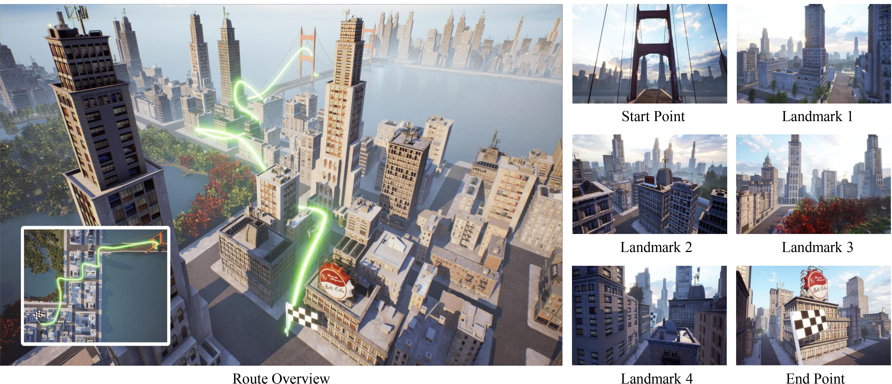

# 🚁 **AerialVLN: Vision-and-Language Navigation for UAVs**

[](https://github.com/AirVLN/AirVLN) 
[](LICENSE) 
[](https://github.com/AirVLN/AirVLN/actions)

---

## 📖 **Table of Contents**
1. [Introduction](#introduction)
2. [Features](#features)
3. [Getting Started](#getting-started)
4. [Example Usage](#example-usage)
5. [Common Errors](#common-errors)
6. [Citation](#citation)
7. [Contact](#contact)
8. [Acknowledgement](#acknowledgement)

此外，你也可以参阅[本页面的中文版本](https://github.com/AirVLN/AirVLN/blob/main/README-ZH.md)

---

## 🌟 **Introduction**

Recently emerged Vision-and-Language Navigation (VLN) tasks have drawn significant attention in both computer vision and natural language processing communities. Existing VLN tasks are built for agents that navigate on the ground, either indoors or outdoors. However, many tasks require intelligent agents to carry out in the sky, such as UAV-based goods delivery, traffic/security patrol, and scenery tour, to name a few. Navigating in the sky is more complicated than on the ground because agents need to consider the flying height and more complex spatial relationship reasoning. To fill this gap and facilitate research in this field, we propose a new task named AerialVLN, which is UAV-based and towards outdoor environments. We develop a 3D simulator rendered by near-realistic pictures of 25 city-level scenarios. Our simulator supports continuous navigation, environment extension and configuration. We also proposed an extended baseline model based on the widely-used cross-modal-alignment (CMA) navigation methods. We find that there is still a significant gap between the baseline model and human performance, which suggests AerialVLN is a new challenging task.


---

## 🚀 **Features**

- **Realistic 3D Simulator**: 25 city-level scenarios with lifelike imagery.
- **Cross-Modal Alignment Model**: Advanced navigation using vision and language.
- **Extensible Framework**: Add new environments and configurations easily.
- **Comprehensive Dataset**: Includes AerialVLN and AerialVLN-S for training and evaluation.


Instruction: Take off, fly through the tower of cable bridge and down to the end of the road. Turn left, fly over the five-floor building with a yellow shop sign and down to the intersection on the left. Head to the park and turn right, fly along the edge of the park. March forward, at the intersection turn right, and finally land in front of the building with a red billboard on its rooftop.

---

## 🛠️ **Getting Started**

### Prerequisites
- Ubuntu Operating System
- Nvidia GPU(s)
- Python 3.8+
- Conda


### Install Dependencies

#### Step 1: Create and enter the workspace folder
```bash
mkdir AirVLN_ws
cd AirVLN_ws
```

#### Step 2: Clone the repository
```bash
git clone https://github.com/AirVLN/AirVLN.git
cd AirVLN
```

#### Step 3: Create and activate a virtual environment
```bash
conda create -n AirVLN python=3.8
conda activate AirVLN
```

#### Step 4: Install pip dependencies
```bash
pip install pip==24.0 setuptools==63.2.0
pip install -r requirements.txt
pip install airsim==1.7.0
```

#### Step 5: Install PyTorch and PyTorch Transformers
Select the correct CUDA version of PyTorch on [PyTorch official website](https://pytorch.org/get-started/locally/).
```bash
pip install torch torchaudio torchvision --index-url https://download.pytorch.org/whl/cuxxx
```

Then install pytorch-transformers which depends on PyTorch.
```bash
pip install pytorch-transformers==1.2.0
```

### Model & Simulator & Datasets


#### Step 6: Create Directories for the following steps

```bash
cd ..
mkdir -p ENVs\
  DATA/data/aerialvln\
  DATA/data/aerialvln-s\
  DATA/models/ddppo-models
```

#### Step 7: Download pretrained model

Download **gibson-2plus-resnet50.pth** from [here](https://github.com/facebookresearch/habitat-lab/tree/v0.1.7/habitat_baselines/rl/ddppo) and place it into `./DATA/models/ddppo-models`.

#### Step 8: Download Simulators

For **AerialVLN simulators (~35GB)**, you may download via [Kaggle website](https://www.kaggle.com/datasets/shuboliu/aerialvln-simulators) by simplely click **Download**, or you may download them via cURL:
```bash
#!/bin/bash
curl -L -o ~/Downloads/aerialvln-simulators.zip\
  https://www.kaggle.com/api/v1/datasets/download/shuboliu/aerialvln-simulators
```

Alternatively, you may download it via kagglehub and then place it under `./ENVs`.
```python
import kagglehub

# Download latest version
path = kagglehub.dataset_download("shuboliu/aerialvln")

print("Path to dataset files:", path)
```

#### Step 9: Download Datasets

For **AerialVLN and AerialVLN-S** annotated data (both less than 100M), you may via [Kaggle website for AerialVLN](https://www.kaggle.com/datasets/shuboliu/aerialvln) and [Kaggle website for AerialVLN-S](https://www.kaggle.com/datasets/shuboliu/aerialvln-s) by simplely click **Download**, or you may download them via cURL:
```bash
#!/bin/bash
curl -L -o ~/Downloads/aerialvln.zip\
  https://www.kaggle.com/api/v1/datasets/download/shuboliu/aerialvln
```
and 
```bash
#!/bin/bash
curl -L -o ~/Downloads/aerialvln.zip\
  https://www.kaggle.com/api/v1/datasets/download/shuboliu/aerialvln-s
```

### Directory Structure

Finally, your project dir should be like this:

```bash
- Project workspace
    - AirVLN
    - DATA
        - data
            - aerialvln
            - aerialvln-s
        - models
            - ddppo-models
    - ENVs
      - env_1
      - env_2
      - ...
```

## 🔧 **Example Usage**

Please see the examples in [scripts](https://github.com/AirVLN/AirVLN/tree/main/scripts).

*Tip: If you are using AirVLN code for the first time, please confirm that the channel order of the images captured in function `_getImages` of [AirVLNSimulatorClientTool.py](https://github.com/AirVLN/AirVLN/blob/main/airsim_plugin/AirVLNSimulatorClientTool.py) is as expected by visualization!*

## 📚 **Common Errors**

1. Error:
    ```
    [Errno 98] Address already in use
    Traceback (most recent call last):
      File "./airsim_plugin/AirVLNSimulatorServerTool.py", line 535, in <module>
        addr, server, thread = serve()
    TypeError: cannot unpack non-iterable NoneType object
    ```
    Possible Solution: Kill the process that is using the port (default port is 30000) or change the port.

2. Error:
    ```
    - INFO - _run_command:139 - Failed to open scenes, machine 0: 127.0.0.1:30000
    - ERROR - run:34 - Request timed out
    - ERROR - _changeEnv:397 - Failed to open scenes Failed to open scenes
    ```
    Possible Solutions: 
      * Try reduce batchsize (e.g. set `--batchSize 1`).
      * Make sure the GPUs are used.
      * Make sure you can open the AirSim scenes in `./ENVs`.

If the solutions above do not help, you can [open an issue](https://github.com/AirVLN/AirVLN/issues) or [contact us via email](#contact).

## 📜 **Citing**
If you use AerialVLN in your research, please cite the following paper:

```
@inproceedings{liu_2023_AerialVLN,
  title={AerialVLN: Vision-and-language Navigation for UAVs},
  author={Shubo Liu and Hongsheng Zhang and Yuankai Qi and Peng Wang and Yanning Zhang and Qi Wu},
  booktitle={International Conference on Computer Vision (ICCV)},
  year={2023}
}
```

In addition, we have noticed that some scholars wish to apply the AerialVLN dataset and simulator to research areas beyond VLN. We fully welcome such endeavors! We also encourage you to contact [us](#contact) and share the intended application areas of your research.

## ✉️ **Contact**
Feel free to contact Shubo LIU via email [shubo.liu@mail.nwpu.edu.cn](mailto:shubo.liu@mail.nwpu.edu.cn) for more support (please also cc to the assistant student's email [omige@mail.nwpu.edu.cn](mailto:omige@mail.nwpu.edu.cn)).

## 🥰 **Acknowledgement**
* We used a pretrained model from [Habitat](https://github.com/facebookresearch/habitat-lab). Thanks sincerely.
